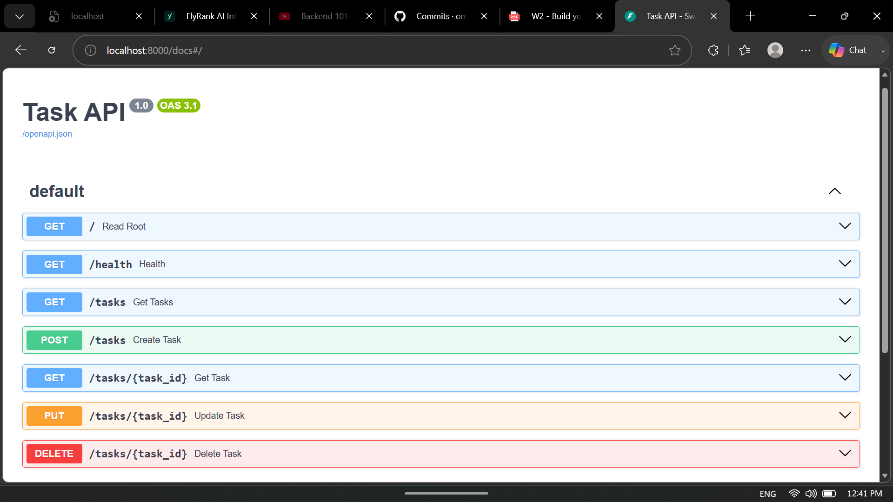

# Task API

A small to-do list CRUD API built with **FastAPI** for the FlyRank Internship — Backend Track, Week 2. You can create tasks, read them, update them, and delete them. Tasks live in an **in-memory list**: restarting the server resets the data to the three seed tasks. That is intentional — no database until Week 3.

## Install & run

You need Python 3.10+ installed. Then:

```powershell
git clone https://github.com/omaraymann/task-api.git
cd task-api
python -m venv .venv
.\.venv\Scripts\Activate.ps1      # Windows — on macOS/Linux: source .venv/bin/activate
pip install -r requirements.txt
uvicorn main:app --reload --port 8000
```

The API is now at **http://localhost:8000** and the interactive Swagger docs at **http://localhost:8000/docs**.

## Endpoints

| Method | Path | What it does | Status codes |
|--------|------|--------------|--------------|
| GET | `/` | Describe the API (name, version, endpoints) | 200 |
| GET | `/health` | Check the server is alive | 200 |
| GET | `/tasks` | List all tasks — optional filters `?done=true|false` and `?search=word` | 200 |
| GET | `/tasks/{id}` | Get one task by id | 200 · 404 unknown id |
| POST | `/tasks` | Create a task from `{"title": "..."}` — server assigns `id`, sets `done: false` | 201 · 400 missing/empty title |
| PUT | `/tasks/{id}` | Update a task's `title` and/or `done` | 200 · 400 invalid body · 404 unknown id |
| DELETE | `/tasks/{id}` | Delete a task (empty response body) | 204 · 404 unknown id |
| GET | `/stats` | Task counts: `{"total": ..., "done": ..., "open": ...}` | 200 |
| POST | `/reset` | Restore the three seed tasks | 200 |

All errors return JSON in the shape `{"error": "..."}`.

## Example request

Creating a task with `curl -i` (real output):

```
$ curl -i -X POST http://localhost:8000/tasks -H "Content-Type: application/json" -d "{\"title\":\"Buy milk\"}"
HTTP/1.1 201 Created
server: uvicorn
content-length: 40
content-type: application/json

{"id":4,"title":"Buy milk","done":false}
```

And asking for a task that doesn't exist:

```
$ curl -i http://localhost:8000/tasks/99
HTTP/1.1 404 Not Found
server: uvicorn
content-length: 29
content-type: application/json

{"error":"Task 99 not found"}
```

## The mortality experiment

I created a few tasks, restarted the server, and `GET /tasks` showed only the three seed tasks again — everything I had created was gone. That happens because the tasks live in a Python list in the process's memory, and memory is wiped when the process stops; a database exists to solve exactly this, which is what Week 3 is about.

## SQL by hand (Week 3, Stage 4)

With the API server still running, I executed this directly against `tasks.db`:

```sql
UPDATE tasks SET done = 1;
```

Immediately afterwards `GET /stats` went from `{"total":3,"done":1,"open":2}` to `{"total":3,"done":3,"open":0}` with no server restart — the API and the SQL tool are reading the exact same file, so there is one source of truth and nothing to "sync".

## Swagger UI

Every endpoint is documented and testable in the browser at `/docs` — the full CRUD cycle works via "Try it out":


